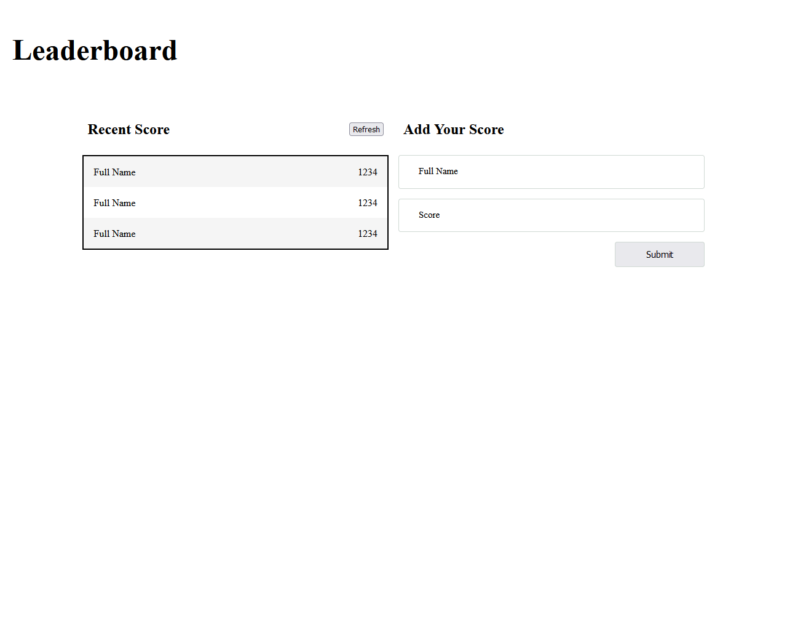

# Leaderboard

> One paragraph statement about the project.



Additional description about the project and its features.

## Built With

- JavaScript, CSS, HTML
- Webpack, jest, SASS, 

## Live Demo

[Live Demo Link](https://carlosmuerto.github.io/Leaderboard/)


## Getting Started

To get a local copy up and running follow these simple example steps.

### Prerequisites
 - Node.js
### Setup
- Clone this repo locally using git and the following git command
```bash 
git clone https://github.com/carlosmuerto/Leaderboard
```
- or with GitHub CLI
```bash
gh repo clone carlosmuerto/Leaderboard
```
### Install dependency
```bash
npm install
```
### Usage: Run dev server
```bash
npm start
```
### Compileling
#### Build
```bash
npm run build
```

#### Watch
```bash
npm run watch
```

### Run tests
```bash
npm run test
```

### Deployment
```bash
npm run deploy
```

## Authors

👤 Carlos Vivas

- GitHub: [@carlosmuerto](https://github.com/carlosmuerto)
- LinkedIn: [LinkedIn](https://www.linkedin.com/in/carlos-vivas-818ab831/)


## 🤝 Contributing

Contributions, issues and feature requests are welcome!

Feel free to check the [issues page](issues/).

## Show your support

Give a ⭐️ if you like this project!

## Acknowledgments

- Hat tip to anyone whose code was used
- Inspiration
- etc

## 📝 License

This project is [MIT](LICENSE.md) licensed.
